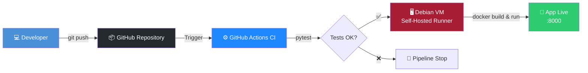

<div align="center">

# 🚀 FastAPI CI/CD Pipeline
### Self-Hosted Local Infrastructure

[](https://github.com/AvotraAder/DevOps-Project-1/actions)

[](https://www.python.org/)
[](https://fastapi.tiangolo.com/)
[](https://www.docker.com/)
[](https://www.debian.org/)
[](https://github.com/features/actions)
[](LICENSE)

End-to-end automated CI/CD pipeline for a **FastAPI** application containerized with **Docker**, deployed on a **Debian (VMware)** virtual infrastructure via a **GitHub Self-Hosted Runner**.

[Features](#-features) •
[Architecture](#-architecture) •
[Installation](#-installation) •
[Usage](#-usage) •
[Author](#-author)

</div>

---

## ✨ Features

- ⚡ **Automatic deployment** on every `push` to `main`
- 🧪 **Unit tests** automatically executed with Pytest
- 🐳 **Docker containerization** with automatic restart
- 🏠 **100% self-hosted infrastructure**, zero cloud costs
- 📖 **Auto-generated Swagger documentation** by FastAPI

---

## 🏗 Architecture



### Pipeline Workflow

| Step | Environment | Actions |
|---|---|---|
| **1. Test** | ☁️ GitHub Cloud | Code checkout → Setup Python 3.11 → Install dependencies → `pytest` |
| **2. Deploy** | 🖥️ Debian VM (self-hosted) | `docker build` → stop/remove old container → run new container (`--restart always`) |

---

## 🛠 Tech Stack

| Component | Technology |
|---|---|
| API Framework | Python 3.11 · FastAPI |
| Containerization | Docker |
| CI/CD Orchestration | GitHub Actions |
| Deployment Environment | Debian 12 (VMware, NAT network) |
| Deployment Agent | GitHub Self-Hosted Runner (systemd service) |

---

## 📁 Repository Structure

```
DevOps-Project-1/
├── .github/
│   └── workflows/
│       └── deploy.yml      # Automated CI/CD pipeline
├── src/
│   ├── app.py              # FastAPI application code
│   ├── requirements.txt     # Python dependencies
│   └── test_app.py         # Pytest unit tests
├── Dockerfile                # Docker image build instructions
└── README.md
```

---

## 🚀 Installation

### Prerequisites

- Debian 12 VM (VMware, NAT or bridge network)
- Administrator access (`sudo`) on the VM
- GitHub repository with runner configuration rights

### 1. Install Docker on the VM

```bash
sudo apt update && sudo apt install -y docker.io
sudo usermod -aG docker $USER
newgrp docker
```

### 2. Install GitHub Runner

```bash
mkdir ~/actions-runner && cd ~/actions-runner

# Configure using commands provided in
# Settings > Actions > Runners > New self-hosted runner
./config.sh --url https://github.com/AvotraAder/DevOps-Project-1 --token <YOUR_TOKEN>

# Install and start the systemd service
sudo ./svc.sh install
sudo ./svc.sh start
```

> 💡 The runner now runs in the background and listens for jobs triggered by GitHub Actions.

---

## 🧪 Usage

Once the pipeline has executed successfully:

**1. Get the VM's IP address**

```bash
hostname -I
```

**2. Access the application**

| Resource | URL |
|---|---|
| 🌐 Main endpoint | `http://<YOUR_VM_IP>:8000/` |
| 📖 Swagger documentation | `http://<YOUR_VM_IP>:8000/docs` |
| 📘 ReDoc documentation | `http://<YOUR_VM_IP>:8000/redoc` |

---

## 🔧 Pipeline Configuration

The `.github/workflows/deploy.yml` file runs automatically on every `push` to the `main` branch:

**Job 1: `test` (GitHub Cloud)**
- Retrieves code
- Installs Python 3.11 and dependencies
- Runs unit tests with `pytest`

**Job 2: `deploy` (Self-Hosted Debian VM)**
- Local runner intercepts the task
- Builds (`docker build`) the new Docker image
- Stops and removes old container if it exists
- Launches new container with automatic restart (`--restart always`)

---

## 🗺 Roadmap

- [ ] Add reverse proxy (Nginx / Traefik) + HTTPS
- [ ] Slack/Discord notifications on deployment failure
- [ ] Monitoring with Prometheus + Grafana
- [ ] Integration tests in addition to unit tests
- [ ] Multi-stage Docker builds for optimization

---

## 🔍 Troubleshooting

**Runner is not showing up in GitHub Actions**
```bash
# Check runner status
cd ~/actions-runner && ./run.sh
```

**Docker permission denied error**
```bash
sudo usermod -aG docker $USER
newgrp docker
# Restart the runner
sudo systemctl restart actions.runner
```

**Application not accessible from host machine**
```bash
# Verify container is running
docker ps

# Check VM network configuration
hostname -I
```

---

## 📝 License

This project is licensed under the MIT License — see the [LICENSE](LICENSE) file for details.

---

## 👤 Author

**Avotra Ader**

[](https://github.com/AvotraAder/DevOps-Project-1)
[](https://twitter.com)

---

<div align="center">

If this project helped you, consider giving it a ⭐!

[⬆ Back to top](#-fastapi-cicd-pipeline)

</div>
