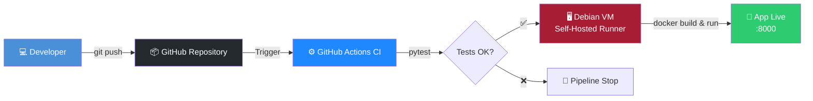

<div align="center">

# 🚀 FastAPI CI/CD Pipeline
### Infrastructure Self-Hosted Locale

[](https://github.com/AvotraAder/DevOps-Project-1/actions)

[](https://www.python.org/)
[](https://fastapi.tiangolo.com/)
[](https://www.docker.com/)
[](https://www.debian.org/)
[](https://github.com/features/actions)
[](LICENSE)

Pipeline CI/CD automatisé de bout en bout pour une application **FastAPI** containerisée avec **Docker**, déployée sur une infrastructure virtuelle **Debian (VMware)** via un **GitHub Self-Hosted Runner**.

[Fonctionnalités](#-fonctionnalités) •
[Architecture](#-architecture) •
[Installation](#-installation) •
[Utilisation](#-utilisation) •
[Auteur](#-auteur)

</div>

---

## ✨ Fonctionnalités

- ⚡ **Déploiement automatique** à chaque `push` sur `main`
- 🧪 **Tests unitaires** exécutés automatiquement avec Pytest
- 🐳 **Containerisation Docker** avec redémarrage automatique
- 🏠 **Infrastructure 100% self-hosted**, aucun coût cloud
- 📖 **Documentation Swagger** générée automatiquement par FastAPI

---

## 🏗 Architecture



### Fonctionnement du pipeline

| Étape | Environnement | Actions |
|---|---|---|
| **1. Test** | ☁️ GitHub Cloud | Checkout du code → Setup Python 3.11 → Install dépendances → `pytest` |
| **2. Deploy** | 🖥️ VM Debian (self-hosted) | `docker build` → stop/remove ancien conteneur → run nouveau conteneur (`--restart always`) |

---

## 🛠 Stack Technique

| Composant | Technologie |
|---|---|
| Framework API | Python 3.11 · FastAPI |
| Conteneurisation | Docker |
| Orchestration CI/CD | GitHub Actions |
| Environnement de déploiement | Debian 12 (VMware, réseau NAT) |
| Agent de déploiement | GitHub Self-Hosted Runner (service systemd) |

---

## 📁 Structure du dépôt

```
DevOps-Project-1/
├── .github/
│   └── workflows/
│       └── deploy.yml      # Pipeline CI/CD automatisé
├── src/
│   ├── main.py              # Code de l'application FastAPI
│   ├── requirements.txt     # Dépendances Python
│   └── test_main.py         # Tests unitaires Pytest
├── Dockerfile                # Instructions de build de l'image Docker
├── .gitignore
└── README.md
```

---

## 🚀 Installation

### Prérequis

- Une VM Debian 12 (VMware, réseau NAT ou bridge)
- Accès administrateur (`sudo`) sur la VM
- Un dépôt GitHub avec les droits de configuration des Runners

### 1. Installer Docker sur la VM

```bash
sudo apt update && sudo apt install -y docker.io
sudo usermod -aG docker $USER
newgrp docker
```

### 2. Installer le Runner GitHub

```bash
mkdir ~/actions-runner && cd ~/actions-runner

# Configurer via les commandes fournies dans
# Settings > Actions > Runners > New self-hosted runner
./config.sh --url https://github.com/AvotraAder/DevOps-Project-1 --token <TON_TOKEN>

# Installer et démarrer le service systemd
sudo ./svc.sh install
sudo ./svc.sh start
```

> 💡 Le Runner tourne désormais en arrière-plan et écoute les jobs déclenchés par GitHub Actions.

---

## 🧪 Utilisation

Une fois le pipeline exécuté avec succès :

**1. Récupérer l'adresse IP de la VM**

```bash
hostname -I
```

**2. Accéder à l'application**

| Ressource | URL |
|---|---|
| 🌐 Endpoint principal | `http://<IP_DE_TA_VM>:8000/` |
| 📖 Documentation Swagger | `http://<IP_DE_TA_VM>:8000/docs` |
| 📘 Documentation ReDoc | `http://<IP_DE_TA_VM>:8000/redoc` |

---

## 🗺 Roadmap

- [ ] Ajouter un reverse proxy (Nginx / Traefik) + HTTPS
- [ ] Notifications Slack/Discord en cas d'échec de déploiement
- [ ] Monitoring avec Prometheus + Grafana
- [ ] Tests d'intégration en plus des tests unitaires

---

## 👤 Auteur

**Avotra Ader**

[](https://github.com/AvotraAder/DevOps-Project-1)

---

<div align="center">

Si ce projet vous a été utile, n'hésitez pas à lui laisser une ⭐ !

</div>
